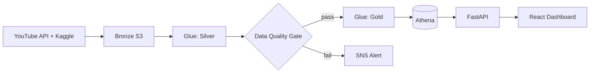
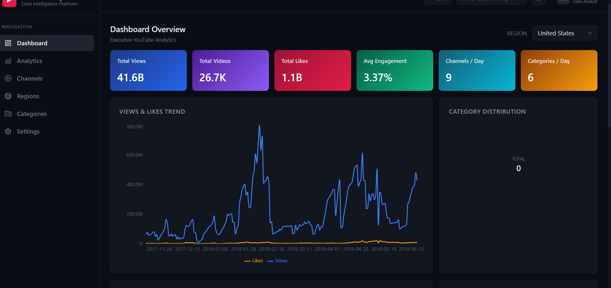
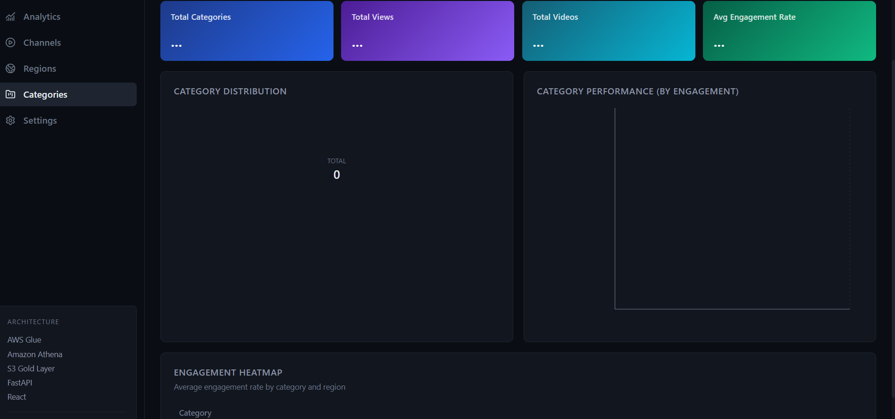

# 📊 YouTube Trending Analytics Platform

An end-to-end analytics platform: a medallion-architecture ETL pipeline on
AWS ingests and cleans YouTube trending data, and a live FastAPI + React
dashboard queries it in real time via Amazon Athena.

[](https://youtube-trending-analytics-dashboar.vercel.app/)
[](https://youtube-trending-analytics-dashboard.onrender.com)
[](docs/AWS-Pipeline.md)
[](docs/AWS-Pipeline.md)
[](docs/Dashboard.md)

| Resource | Link |
|---|---|
| 🌐 **Live Dashboard** | **[youtube-trending-analytics-dashboar.vercel.app](https://youtube-trending-analytics-dashboar.vercel.app/)** |
| ⚡ **API** | **[youtube-trending-analytics-dashboard.onrender.com](https://youtube-trending-analytics-dashboard.onrender.com)** |
| 💻 **Repo** | **[github.com/rohitmhala/youtube-trending-analytics-dashboard](https://github.com/rohitmhala/youtube-trending-analytics-dashboard)** |

> Backend runs on Render's free tier — the first load after inactivity may
> take 30–60s while it cold-starts.

---

## Overview

YouTube's trending page shows *what's* trending — it doesn't answer which
categories are gaining share, which channels trend consistently, or how
engagement varies by region. This platform answers those questions with
real data, end to end:

1. **Pipeline** — ingests live YouTube API + Kaggle historical data across
   10 regions, refines it through Bronze → Silver → Gold with an automated
   data quality gate.
2. **Dashboard** — queries the Gold layer live via Athena and presents it as
   KPIs, trends, rankings, and auto-generated business insights.

Nothing is mocked — every chart is a live SQL aggregation.

---

## Architecture



Full diagrams and pipeline detail: [`docs/Architecture.md`](docs/Architecture.md) · [`docs/AWS-Pipeline.md`](docs/AWS-Pipeline.md)

---

## Screenshots




---

## Features

- **6 dashboards** — Overview, Analytics, Channels, Categories, Regions, Settings
- Region filtering across every analytical view
- Interactive charts: trend lines, donuts, bar charts, scatter plots, a geo
  map, and a category × region heatmap
- Searchable, paginated channel tables
- Auto-generated business insights (top channel/category/region, computed
  live, not hardcoded)
- Automated data quality gate upstream (row count, nulls, schema, freshness)

---

## Tech Stack

**Data Engineering:** AWS Lambda · Glue (PySpark) · S3 · Step Functions · EventBridge · Athena · SNS · CloudWatch
**Backend:** FastAPI · boto3 / PyAthena · pandas
**Frontend:** React 19 · TypeScript · Vite · Tailwind CSS v4 · Recharts · Leaflet

---

## Project Structure

```
youtube-trending-analytics-dashboard/
├── pipeline/       # AWS ETL: Lambdas, Glue jobs, Step Functions
├── backend/        # FastAPI - queries Athena, exposes REST API
├── frontend/       # React + TypeScript dashboard
└── docs/           # Detailed documentation (see below)
```

---

## 📚 Documentation

- 📘 [AWS Pipeline](docs/AWS-Pipeline.md) — data flow, quality gates, orchestration
- 📊 [Dashboard](docs/Dashboard.md) — pages, data model, API reference, local setup
- 🏗 [Architecture](docs/Architecture.md) — full diagrams
- 🚀 [Deployment](docs/Deployment.md) — Vercel + Render deployment guide

---

## Author

**Rohit Mhala** — Data Analyst
[GitHub](https://github.com/rohitmhala) · [Live Dashboard](https://youtube-trending-analytics-dashboar.vercel.app/)

<p align="center">⭐ If this is useful, a star is appreciated.</p>
