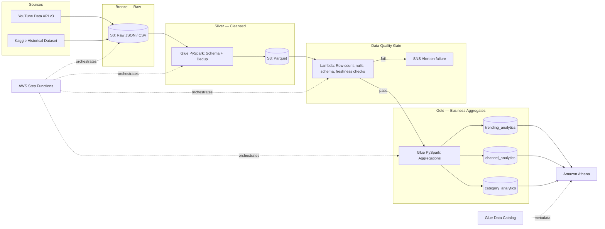
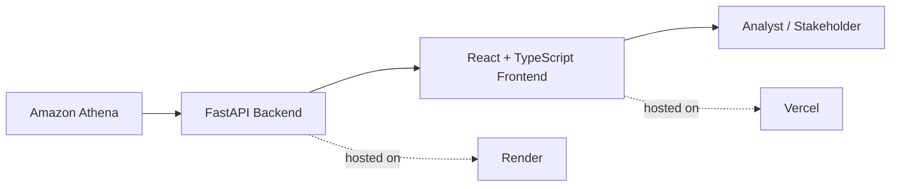

# Architecture

## Data Pipeline

## Analytics Application

The backend exists for one reason: Athena needs AWS credentials to run
queries, and those credentials should never reach the browser. FastAPI is a
stateless query executor — every request runs real SQL against Athena and
returns clean JSON, so the dashboard always reflects the Gold layer's
current state.
